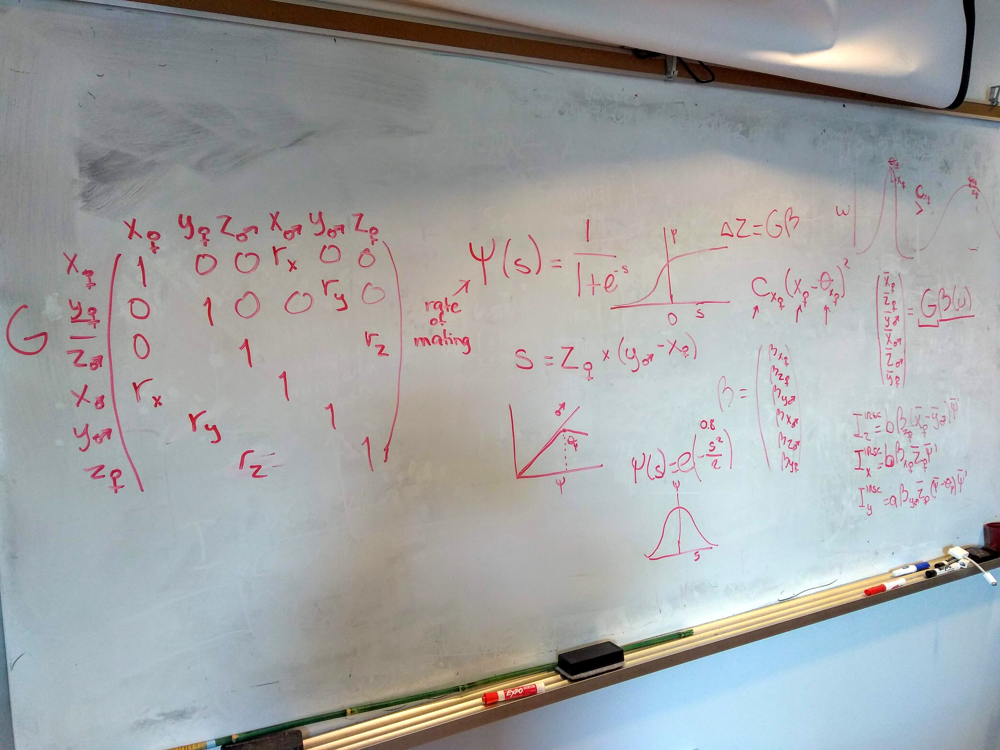
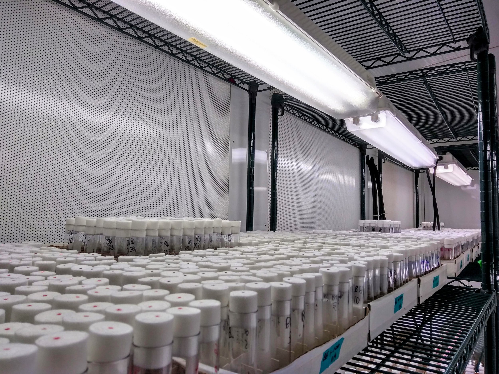

---
---

# Grieshop Lab

We study the evolutionary causes and consequences of genetic variation underlying fitness trade-offs between sexes, traits, tissues, life-stages, and environments. Our interdisciplinary approach blends lab experiments, quantitative genetics, genomics, bioinformatics, and mathematical modelling to understand these trade-offs, primarily in the fruit fly *Drosophila melanogaster*.



## Highlights

  <figure>
    
    <figcaption>Equations: Tania S. Barrera; Photo: Karl Grieshop</figcaption>
  </figure>
  <figure>
    
    <figcaption>Photo: Karl Grieshop</figcaption>
  </figure>
  <figure>
    
    <figcaption>Photo: Karl Grieshop</figcaption>
  </figure>
  <figure>
    
    <figcaption>Photo: Karl Grieshop</figcaption>
  </figure>

---

## Research

My lab aims to understand the evolutionary causes and consequences of genetic variation underlying fitness trade-offs between sexes, traits, tissues, life-stages and environments. This includes topics such as sexual conflict, antagonistic pleiotropy, fluctuating selection, phenotypic plasticity and local adaptation, which have implications for wildlife conservation, pest management, and genetic disease. We take an interdisciplinary approach, blending lab experiments, statistics, quantitative genetics, bioinformatics, molecular genetics and mathematical modelling to understand these genetic trade-offs in the fruit fly *Drosophila melanogaster*. Similar questions are tackled in other organisms (birds, plants, other arthropods) through various collaborations.

Informal inquiries about joining the lab are always welcome. [Get in touch](contact).

---
