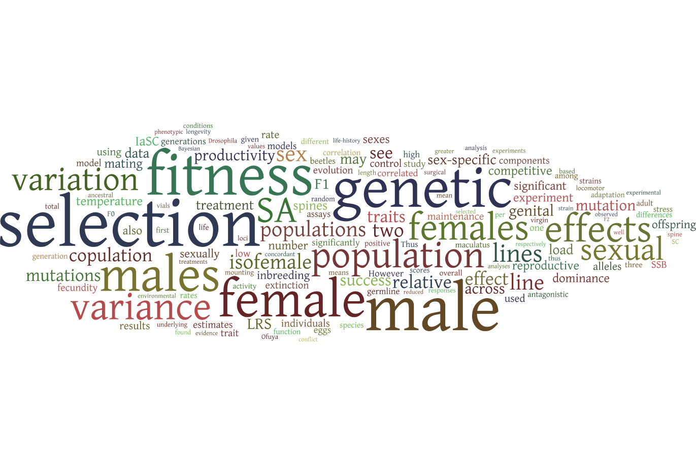

# Research

## Overview

My lab aims to understand the evolutionary causes and consequences of genetic variation underlying fitness trade-offs between sexes, traits, tissues, life-stages and environments. This includes topics such as sexual conflict, antagonistic pleiotropy, fluctuating selection, phenotypic plasticity and local adaptation, which have implications for wildlife conservation, pest management, and genetic disease. We take an interdisciplinary approach, blending lab experiments, statistics, quantitative genetics, bioinformatics, molecular genetics and mathematical modelling to understand these genetic trade-offs in the fruit fly *Drosophila melanogaster*. Similar questions are tackled in other organisms (birds, plants, other arthropods) through various collaborations.

---

## Detecting antagonistic loci

The field is only scratching the surface on the number and location of antagonistic polymorphisms in the genome, their molecular and population genetic characteristics, and the phenotypes they govern. The lab is interested in developing novel methodologies for identifying candidate antagonistic polymorphisms using a combination of quantitative genetics, genomics, transcriptomics, experimental evolution, genome editing, phenotyping, and mathematical modelling. Some of this work aims to leverage a conspicuous pattern of Mendelian inheritance that antagonistic polymorphisms should be enriched for: dominance reversals (see next section).

---

## Dominance reversal

Sex-specific dominance reversal—where the allele that benefits a given sex is also dominant in that sex—partially resolves genetic conflicts, facilitates local adaptation, and can help maintain genetic variation. Dominance reversals have seen growing [theoretical and empirical support](https://royalsocietypublishing.org/doi/full/10.1098/rspb.2023.2816). Understanding how dominance reversals occur may help detect antagonistic polymorphisms.

Sex differences in (allele-specific) gene expression brought on by certain combinations of sex-limited *trans*-acting proteins, their concentrations, and/or *cis*-acting SNPs in their regulatory regions may be a common means by which sex-specific dominance reversal is achieved. Our biophysically explicit models of gene regulation represent a proof of concept that some patterns of sex-/allele-specific expression are consistent with sex-specific dominance reversals for fitness.

---

## Genetic architecture

Genetic architecture can refer to either the mode of inheritance in, or the genetic covariances among, fitness and life history traits. These features ultimately determine a range of characteristics with basic and applied evolutionary implications such as the maintenance of genetic variation, the maintenance of sexual reproduction, adaptation, wildlife management, and public health.

I am broadly interested in applying quantitative genetic methods to questions of the genetic architecture for fitness. Past quantitative genetics projects have used a variety of plant and animal systems to look at [sex-specific dominance reversal](https://journals.plos.org/plosbiology/article?id=10.1371/journal.pbio.2006810), [sex-specific selection against mutation load](https://academic.oup.com/evlett/article/5/4/328/6697686), [the genetic basis of the male fighter/scrambler morphs](https://academic.oup.com/evolut/article/77/6/1289/7059090), [the (multivariate) genetic variance-covariance matrix (**G**)](https://royalsocietypublishing.org/doi/full/10.1098/rspb.2020.2908), and [the role of dominance in facilitating local adaptation](https://www.biorxiv.org/content/10.1101/2022.10.01.510426v1.abstract). We are especially interested in connecting quantitative genetics with ‘omics methods to better understand evolution.

---
